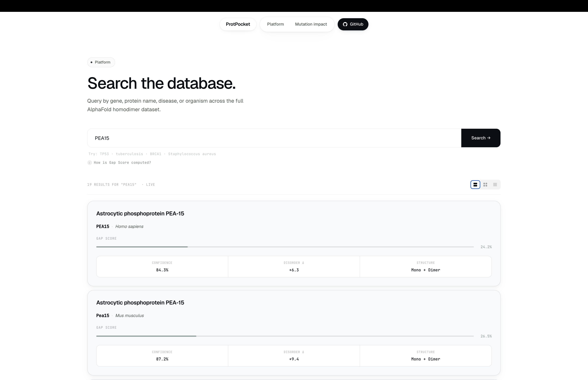
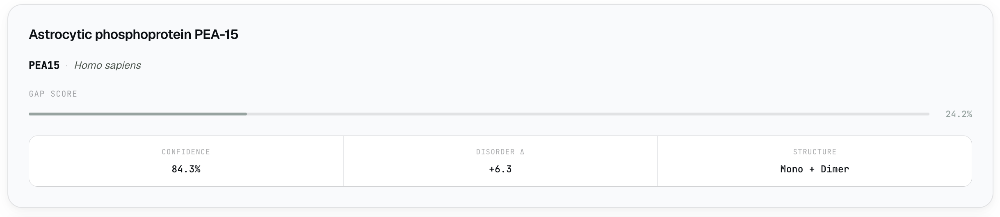
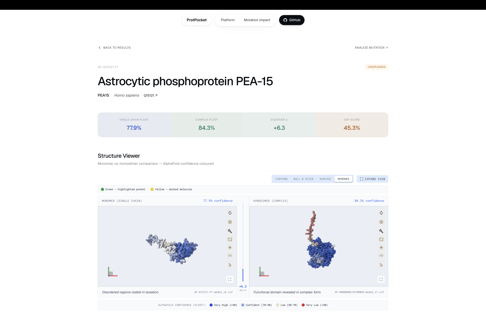
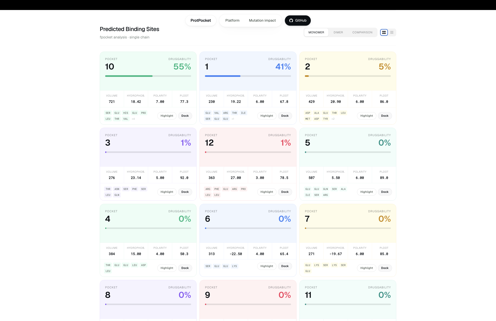
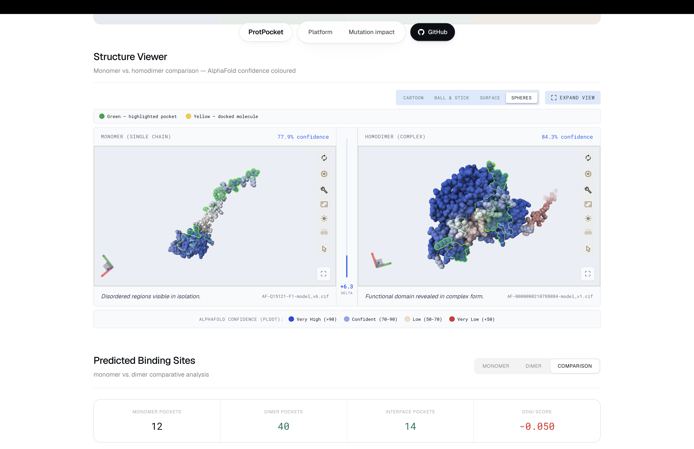
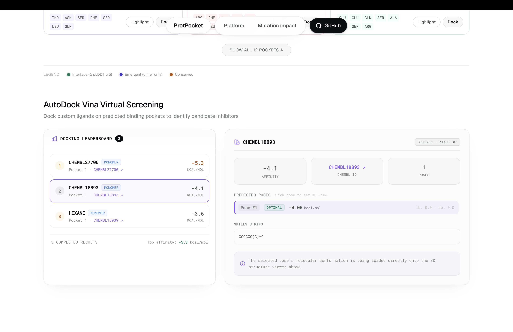
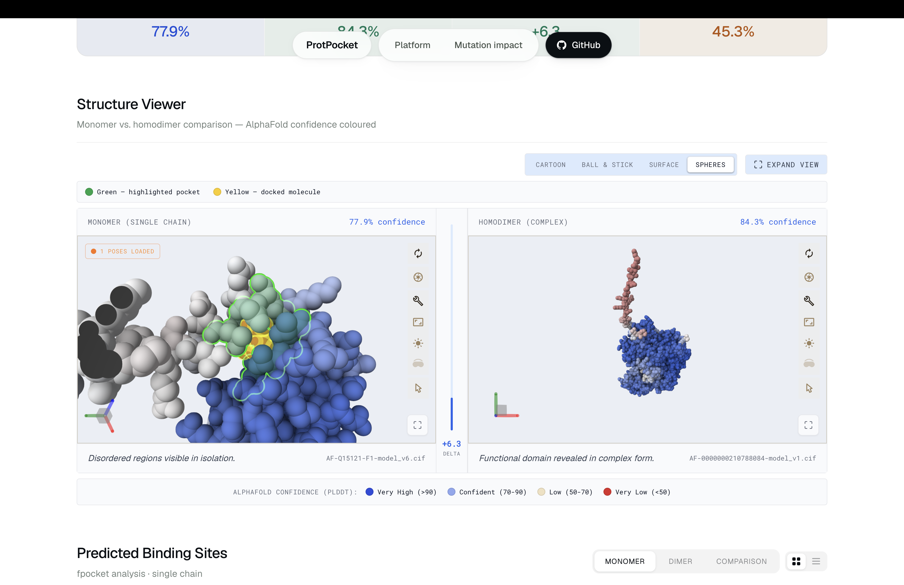

# ProtPocket

**From protein search to ranked target insights — in seconds.**

ProtPocket is an open-source research prototype for exploring protein targets in one browser workflow. Search any protein by name, gene symbol, or accession number, and ProtPocket brings together [AlphaFold](https://alphafold.ebi.ac.uk/) structure predictions, monomer-vs-homodimer comparison, pocket detection, mutation impact scoring, molecule suggestions, exploratory docking, and interactive 3D visualization.

The goal is to help researchers move quickly from a protein query to testable structural hypotheses: Which pockets exist? Do new pockets appear in the homodimer? Are they near important mutations? Are there candidate molecules that could fit? How confident is the predicted structure?

**Live:** [https://protpocket.ayushz.me](https://protpocket.ayushz.me)

---

## Table of Contents

1. [Why ProtPocket](#why-protpocket)
2. [Example: PEA15](#example-pea15)

   * [Search](#search)
   * [Result card](#result-card)
   * [Pocket analysis](#pocket-analysis)
   * [Molecular docking](#molecular-docking)
   * [Mutation impact](#mutation-impact)
3. [The Gap Score](#the-gap-score)
4. [Data Sources](#data-sources)
5. [Installation](#installation)

---

## Why ProtPocket?

Many proteins function as complexes, and in some cases two identical chains form a homodimer with pockets that are not visible in the single-chain structure. These interface pockets can be valuable starting points for drug-discovery research, but they are easy to miss when tools analyze only the monomer.

ProtPocket compares AlphaFold monomer and homodimer predictions side by side, detects pockets in both structures, highlights candidate interface pockets, and connects them with mutation and docking context.

For every protein you search, ProtPocket can:

* Fetch available AlphaFold monomer and homodimer structure predictions
* Run fpocket-based pocket detection on both structures
* Highlight pockets that appear or become more defined in the homodimer
* Score proteins using structural confidence, approved-drug coverage, pathogen priority, and disorder-change signals
* Suggest candidate molecules or fragments from ChEMBL
* Run exploratory AutoDock Vina docking in selected pockets
* Visualize structures, pockets, mutations, and docking poses in Mol*

The predicted complex structures are based on the [2026 AlphaFold Database complex expansion](https://www.embl.org/news/science-technology/first-complexes-alphafold-database/), which includes large-scale homomeric and heteromeric protein complex predictions.


---

## Example: PEA15

PEA15 is a small human adaptor protein involved in apoptosis and MAPK/ERK signaling, with links to cancer biology and type 2 diabetes. It has no approved drugs in ProtPocket's current ChEMBL-based lookup. In this walkthrough, ProtPocket uses PEA15 as an example where the predicted homodimer highlights interface-like pockets that are less apparent in the monomer, making it useful for exploring structure-based hypotheses.

### Search

Go to [protpocket.ayushz.me](https://protpocket.ayushz.me) and type `PEA15` into the search bar.

ProtPocket recognises this as a gene name and queries [UniProt](https://www.uniprot.org/), [AlphaFold](https://alphafold.ebi.ac.uk/), and [ChEMBL](https://www.ebi.ac.uk/chembl/) at the same time. Within a few seconds you see a list of matching proteins with their scores.



### Result card

Each card shows three numbers at a glance:

| Field | What it means |
|-------|---------------|
| **Confidence** | [AlphaFold](https://alphafold.ebi.ac.uk/)'s confidence in the predicted structure, averaged across the homodimer. Scores above 70 are considered reliable. |
| **Disorder Δ** | How much more ordered the protein becomes when it dimerizes. A positive number means the functional shape only appears in the two-chain form. PEA15 shows +6.3 here. |
| **Gap Score** | ProtPocket's priority score. Higher means more urgently undrugged. PEA15 scores high because it is well-predicted as a dimer, has zero approved drugs, and its structure is revealed by dimerization. |



Click the card to open the full detail page, which shows the monomer and homodimer structures side by side and all the key metrics in one view.



### Pocket analysis

ProtPocket downloads both structure files and scans each one for surface pockets. This runs on the server — nothing is downloaded to your computer.

**Single-chain vs homodimer:** The lone PEA15 chain has only shallow, poorly defined pockets. When both chains are present, the structure locks into shape and new, deeper pockets appear at the interface — pockets that did not exist before. These are flagged as **interface pockets** and sorted to the top of the list.



A molecule that binds an interface pocket could, in principle, disrupt or weaken the chain-chain interaction. ProtPocket treats this as a computational hypothesis that would require experimental validation.

**What the disorder delta is telling you:** PEA15's single chain has low structural confidence. The homodimer is much more ordered (+6.3). The residues that become ordered are the ones forming the dimer interface — precisely the ones lining the top-ranked pockets.

The full expanded view shows both structures side by side with pockets highlighted in green. Blue regions mean [AlphaFold](https://alphafold.ebi.ac.uk/) is confident about those positions; orange/red regions are less certain.



### Molecular docking

Once pocket analysis is done you can test whether a small molecule fits inside any pocket.

**Select a pocket and molecule.** Choose the top-ranked interface pocket. You will see a list of fragment molecules whose shapes are a geometric match for this cavity, drawn from [ChEMBL](https://www.ebi.ac.uk/chembl/) — a public database of molecules with known biological activity. Select one and click **Run Docking**.



Behind the scenes ProtPocket converts the fragment into a 3D shape, prepares the PEA15 homodimer as the docking target, and runs [AutoDock Vina](https://vina.scripps.edu/) to test how and where the fragment fits inside the pocket. Results stream back to the browser automatically.

**View the result.** The [Mol*](https://molstar.org/) 3D viewer loads the top-ranked pose sitting inside the PEA15 structure. You can rotate, zoom, and switch between alternative conformations using the leaderboard. A molecule sitting inside a blue (high-confidence) region is a trustworthy result.



**Reading the scores.** Each conformation is ranked by predicted binding affinity in kcal/mol. More negative = stronger predicted binding. More negative scores generally indicate stronger predicted binding in the Vina scoring function. In ProtPocket, these scores are used for rough ranking only; they are not comparable across all proteins or proof of real binding. These are computational estimates — they guide which fragments are worth testing in the lab, not a guarantee of real-world binding.

### Mutation impact

> **Coming soon** — implemented but not yet on the live site.

Enter a mutation (e.g. `EGFR T790M`) and a UniProt accession to see how it affects pocket druggability. ProtPocket looks up the variant's pathogenicity in [AlphaMissense](https://alphamissense.hegelab.org/), compares wildtype and mutant pocket geometry via [fpocket](https://github.com/Discngine/fpocket), and produces a **Druggability Shift Score** (DSS) from −1 to +1:

| DSS range | Classification |
|-----------|----------------|
| ≥ +0.15 | Pocket improved / created |
| −0.15 to +0.15 | Pocket unchanged |
| ≤ −0.15 | Pocket degraded / collapsed |

Mutant structures are sourced from [RCSB PDB](https://www.rcsb.org/) when available; otherwise the wildtype backbone is used as an approximation and the score relies more on AlphaMissense pathogenicity.

---

## The Gap Score

The Gap Score is a heuristic priority score for surfacing structurally confident, underexplored protein targets that may be worth follow-up.

```
Gap Score = pLDDT_norm × undrugged_factor × WHO_multiplier + disorder_bonus
```

- **pLDDT_norm** — structural confidence, normalized 0–1. Unreliable predictions don't rank highly.
- **undrugged_factor** — how uncovered the target is by existing drugs. Zero approved drugs = 1.0 (maximum urgency). More drugs = lower score.
- **WHO_multiplier** — a 2× boost for proteins from pathogens on the WHO's critical antimicrobial resistance list.
- **disorder_bonus** — a small addition when the protein's structure is significantly more ordered in the dimer than the monomer, rewarding the most scientifically novel entries in the dataset.

Results on the homepage are sorted by Gap Score descending — the most urgently undrugged, well-predicted complex appears first.

---

## Data Sources

| Source | Role |
|--------|------|
| **[AlphaFold Database](https://alphafold.ebi.ac.uk/)** ([EMBL-EBI](https://www.ebi.ac.uk/) / [Google DeepMind](https://deepmind.google/)) | Single-chain and homodimer structure predictions |
| **[UniProt](https://www.uniprot.org/)** | Gene names, organism, disease associations |
| **[ChEMBL](https://www.ebi.ac.uk/chembl/)** ([EMBL-EBI](https://www.ebi.ac.uk/)) | Approved drug counts and fragment suggestions |
| **[AlphaMissense](https://alphamissense.hegelab.org/)** ([Google DeepMind](https://deepmind.google/)) | Pathogenicity scores for 216M single amino-acid variants |
| **[RCSB PDB](https://www.rcsb.org/)** | Experimental mutant structures for mutation analysis |
| **[fpocket](https://github.com/Discngine/fpocket)** | Pocket detection, runs locally on the server |
| **[AutoDock Vina](https://vina.scripps.edu/)** | Docking engine, runs locally on the server |
| **[Open Babel](https://openbabel.org/)** | Molecular format conversions |
| **[WHO Priority Pathogen List (2024)](https://www.who.int/publications/i/item/9789240093461)** | Powers the 2× Gap Score multiplier for critical pathogens |

ProtPocket does not store or redistribute [AlphaFold](https://alphafold.ebi.ac.uk/) structure files. All structure data is linked directly to [EMBL-EBI](https://www.ebi.ac.uk/)'s servers.

---

## Installation

See [INSTALLATION.md](./INSTALLATION.md) for self-hosting instructions.

---

## Citation

If you use ProtPocket in research, please cite the AlphaFold Database and the March 2026 complex release:

> Fleming J. et al. AlphaFold Protein Structure Database and 3D-Beacons: New Data and Capabilities. *Journal of Molecular Biology* (2025).

> EMBL-EBI, Google DeepMind, NVIDIA, Seoul National University. Millions of protein complexes added to AlphaFold Database. March 16, 2026. https://www.embl.org/news/science-technology/first-complexes-alphafold-database/
