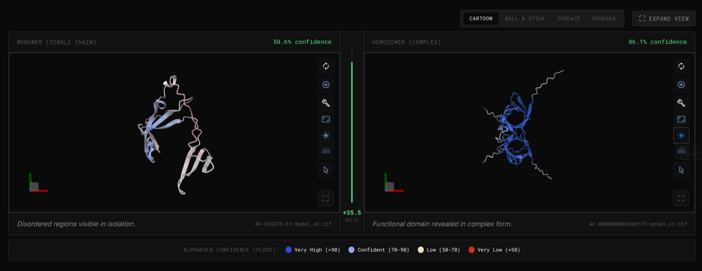
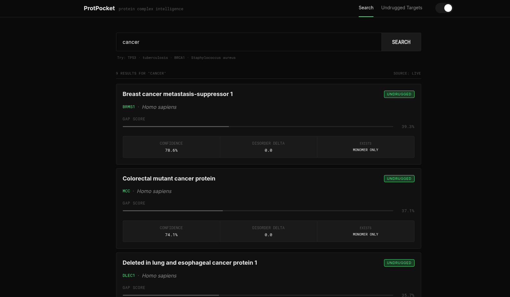
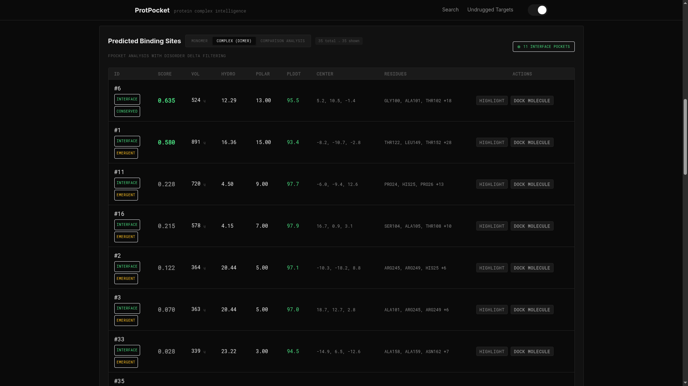
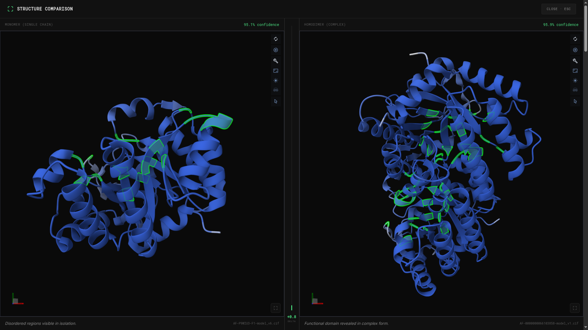
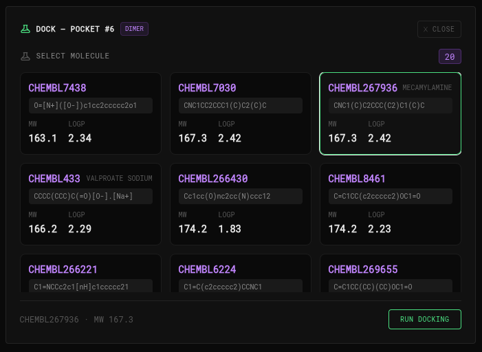
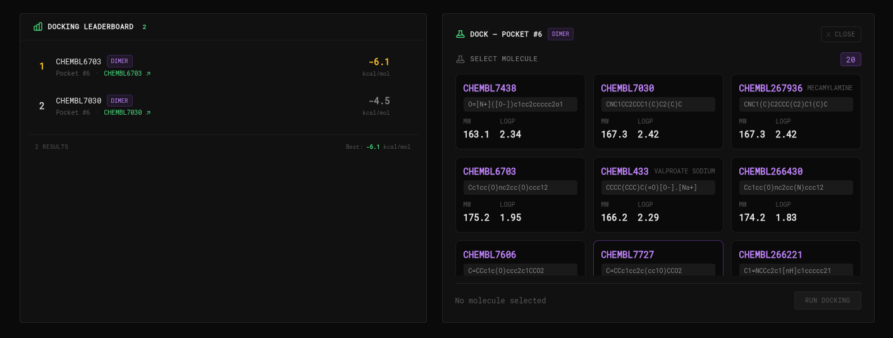
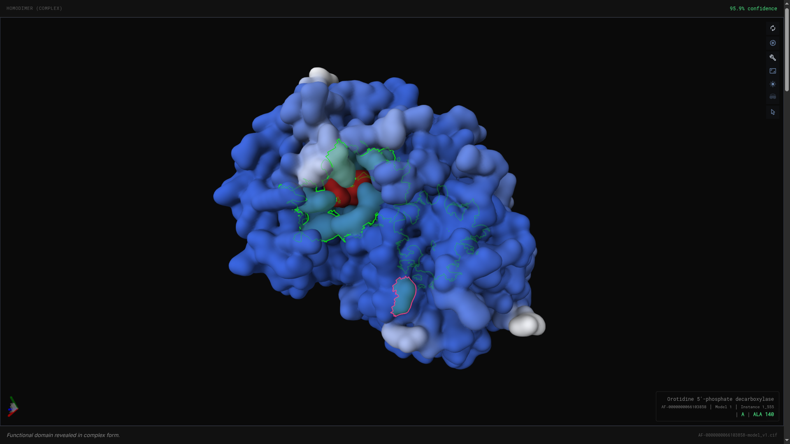

# ProtPocket

**From protein name to ranked drug binding sites — automated, in seconds.**

ProtPocket is an open-source computational drug discovery platform that takes a protein name, gene symbol, disease, or UniProt accession as input and returns a complete structural analysis: real-time complex data from AlphaFold, drug target prioritization via an original **Gap Score** algorithm, interactive 3D structure comparison, automated binding site detection using fpocket, fragment molecule suggestions from ChEMBL, live molecular docking via AutoDock Vina, and mutation impact prediction with AlphaMissense — all in one browser-based workflow.

Built on top of the **AlphaFold homodimer dataset** released March 16, 2026 by EMBL-EBI, Google DeepMind, NVIDIA, and Seoul National University — the largest protein complex dataset ever assembled. ProtPocket is, to our knowledge, the first tool to make this dataset queryable by drug discovery priority through a live API pipeline.

---

## Table of Contents

1. [The Problem](#the-problem)
2. [Features at a Glance](#features-at-a-glance)
3. [How ProtPocket Works](#how-protpocket-works)
   - [Search & Query Classification](#search--query-classification)
   - [Disorder Delta & Structural Comparison](#disorder-delta--structural-comparison)
   - [Gap Score Ranking](#gap-score-ranking)
   - [Binding Site Detection](#binding-site-detection-with-fpocket)
   - [Pocket Comparison Analytics](#pocket-comparison-analytics)
   - [Fragment Suggestion](#fragment-suggestion-from-chembl)
   - [Live Molecular Docking](#live-molecular-docking-autodock-vina)
   - [Mutation Impact Prediction](#mutation-impact-prediction)
   - [Undrugged Targets Dashboard](#undrugged-targets-dashboard)
4. [Scoring Algorithms](#scoring-algorithms)
   - [The Gap Score](#the-gap-score)
   - [Druggability Shift Score (DSS)](#druggability-shift-score-dss)
5. [Architecture](#architecture)
6. [Project Structure](#project-structure)
7. [Installation & Setup](#installation--setup)
8. [API Endpoints](#api-endpoints)
9. [Data Sources](#data-sources)
10. [Roadmap](#roadmap)
11. [Citation](#citation)
12. [License](#license)

---

## The Problem

Protein structures have been the foundation of rational drug design for decades. When researchers know the three-dimensional shape of a protein involved in disease, they can in principle design a molecule that fits into a cavity on its surface and disrupts its function. The challenge has always been bridging the gap between having a structure and knowing where and how to target it.

The traditional workflow is brutally fragmented. A researcher investigating a tuberculosis protein today must query AlphaFold manually for the structure, visit UniProt separately for disease context, run ChEMBL queries independently for drug coverage, download structure files locally, run pocket detection software from a command line, and then consult fragment databases with another tool entirely. Each step requires a different interface, produces output in a different format, and demands familiarity with a different tool. Most researchers do not have access to expensive commercial suites — Schrödinger, MOE, Discovery Studio — that partially unify these workflows.

Even those who do still face a deeper problem: **most tools operate on monomer structures only**. A monomer is a single protein chain in isolation. A homodimer is two identical chains bound together. The biological reality is that most proteins only execute their functional role as dimers or larger complexes. The interface between two chains creates surface cavities — pockets — that do not exist in either chain alone. These **interface pockets** are among the most valuable drug targets in modern pharmacology, the basis of protein-protein interaction (PPI) inhibitor programs. Yet they are invisible to any tool that analyzes monomers only.

The March 2026 AlphaFold homodimer release changed the availability of complex structural data fundamentally. But it provided no tooling to query the data by drug discovery priority, no way to run pocket analysis on the new structures programmatically, and no connection to fragment databases. **The dataset existed but was not actionable.** ProtPocket makes it actionable.

---

## Features at a Glance

| Feature | Description |
|---------|-------------|
| **🔍 Multi-source Search** | Query by gene name, disease, UniProt ID, or AlphaFold ID with real-time streaming results |
| **📊 Gap Score Ranking** | Original algorithm prioritizing undrugged, high-confidence targets from WHO priority pathogens |
| **🧬 3D Structure Viewer** | Interactive Mol* viewer with pLDDT confidence coloring and monomer/dimer toggle |
| **🕳️ Binding Site Detection** | Automated fpocket analysis on both monomer and dimer structures |
| **🔗 Interface Pocket Discovery** | Identifies cavities unique to the dimer form — the "holy grail" of PPI drug targets |
| **📈 Pocket Comparison** | Comprehensive monomer vs dimer analytics with charts, property changes, and stabilization metrics |
| **💊 Fragment Suggestions** | ChEMBL-matched small molecules ranked by pocket geometry compatibility |
| **⚗️ Live Molecular Docking** | AutoDock Vina integration with async job management and 3D pose visualization |
| **🧪 Mutation Impact Prediction** | AlphaMissense pathogenicity + fpocket geometry analysis = Druggability Shift Score |
| **🏆 Undrugged Dashboard** | Pre-ranked leaderboard of 28 high-priority undrugged protein targets |

---

## How ProtPocket Works

### Search & Query Classification

When a researcher submits a query — whether it is a gene name like `TP53`, a disease term like `tuberculosis`, a UniProt accession like `P04637`, or an AlphaFold ID like `AF-0000000066503175` — ProtPocket first classifies the query type and routes it appropriately.

Results stream to the browser in real time via **Server-Sent Events (SSE)**:

1. **Hero matches** appear instantly (<1 ms) — a curated set of 30 well-known proteins is checked first against a local JSON file
2. **UniProt results** stream progressively as each protein is enriched concurrently via Go goroutines — AlphaFold for structure data, UniProt for metadata, and the Gap Score is computed before each result is pushed

Only Swiss-Prot (reviewed) entries are returned. Drug coverage is intentionally deferred to the detail page to keep search fast.

### Disorder Delta & Structural Comparison

For every protein, ProtPocket computes the **disorder delta** — the difference in average pLDDT confidence between the monomer and homodimer AlphaFold predictions. This single number captures the structural reveal: how much the protein gains in ordered, confident structure when it finds its binding partner.

A disorder delta of +36 means the protein went from 50% structural confidence in isolation to 86% confidence in complex form — the functional shape was completely hidden in the monomer and emerged only in the dimer.

The detail page renders both structures in the **Mol\*** 3D viewer, colored by per-residue pLDDT confidence. Blue regions are predicted with high confidence; red and orange regions are disordered.



### Gap Score Ranking

Every protein in the results is ranked by the original **Gap Score** that answers: *how urgently does the world need a drug for this target?* The score combines structural confidence, drug coverage from ChEMBL, WHO priority pathogen status, and the disorder delta bonus. Results are sorted descending — the most urgently undrugged, high-confidence target appears first.



### Binding Site Detection with fpocket

When a researcher requests pocket analysis, ProtPocket runs **fpocket** concurrently on both the monomer and the homodimer structure files. fpocket identifies surface cavities using Voronoi tessellation and alpha sphere algorithms, returning each pocket with a druggability score, volume in cubic Ångströms, surface area, depth, hydrophobicity, polarity, and the residues lining it.



The pipeline then performs three additional stages:

1. **Interface detection** — pockets spanning multiple chains in the dimer are flagged as interface pockets
2. **pLDDT cross-referencing** — per-residue AlphaFold confidence is fetched, and pockets whose lining residues gained the most confidence in the dimer (average Δ pLDDT ≥ 5.0) are prioritized
3. **Comparison** — monomer and dimer pocket lists are compared geometrically (6.0 Å distance threshold) to classify pockets as conserved, emergent, or monomer-only



The Mol* viewer highlights identified pocket residues directly on the structure, allowing visual inspection of cavity geometry.

### Pocket Comparison Analytics

After binding site detection, ProtPocket generates comprehensive comparison analytics:

- **DDGI** (Dimerization-Driven Druggability Gain Index) — single metric for how much druggability improves in the dimer
- **Pocket mapping** — conserved, emergent, monomer-only, and interface counts
- **Property changes** — average volume, hydrophobicity, polarity differences between monomer and dimer
- **Stabilization scatter** — pLDDT delta vs druggability score per pocket
- **Enrichment score** — fraction of structurally stabilized residues falling in interface pockets
- **Fragment comparison** — unique dimer-only and interface-only fragments

### Fragment Suggestion from ChEMBL

For each identified pocket, ProtPocket queries ChEMBL for small molecule fragments whose properties match the cavity geometry:

1. **Molecular weight ceiling** derived from pocket volume (120–300 Da)
2. **LogP matching** from pocket hydrophobicity (±1.0 tolerance)
3. **Polar H-bond matching** from pocket polarity (±2.0 tolerance)
4. **SMILES validation** via Open Babel subprocess (rejects invalid structures)
5. **Scoring** by composite distance from ideal properties

Returns up to 20 fragments per pocket, ranked by match quality.



### Live Molecular Docking (AutoDock Vina)

Once fragments are suggested, researchers can validate their fit directly in the browser via integrated **AutoDock Vina** docking:

1. Converts the 1D SMILES string into a 3D ligand conformation using **Open Babel**
2. Prepares the AlphaFold receptor by converting it to PDBQT format (with rigid-receptor sanitization)
3. Sets the docking search space bounding box over the fpocket-derived center of the cavity (25 Å box, exhaustiveness=16)
4. Executes Vina asynchronously in the background

Results include binding affinity scores (kcal/mol) and docked 3D poses displayed in a leaderboard:



The resulting ligand conformations are loaded directly into the Mol* viewer:



### Mutation Impact Prediction

ProtPocket's **Mutation Impact Predictor** answers: *does a specific amino acid mutation make a protein more or less druggable?*

The analysis runs in four stages via `POST /mutation/analyze`:

```
Input: "EGFR T790M" + UniProt ID P00533

Stage 1: Parse mutation
  → Gene: EGFR, Position: 790, Wildtype: T (Thr), Mutant: M (Met)

Stage 2 (parallel):
  a) AlphaMissense lookup → Pathogenicity: 0.966, Class: "pathogenic"
  b) Structure fetch → Wildtype: AlphaFold AF-P00533-F1
                       Mutant: RCSB PDB 6S89 (experimental)

Stage 3: fpocket on both structures
  → Wildtype top pocket: druggability 0.814, volume 1966 ų
  → Mutant top pocket:   druggability 0.757, volume 737 ų
  → ΔVolume: -1229, ΔHydrophobicity: +7.70

Stage 4: Druggability Shift Score
  → DSS = -0.499, Classification: "pocket_degraded", Confidence: "high"
```

**Accepted mutation formats:** `EGFR T790M`, `T790M`, `p.T790M`, `EGFR p.T790M` (case-insensitive)

**AlphaMissense integration:** The AlphaMissense database (216M+ variant scores) is indexed into a local SQLite database with ~2.6 ms query latency.

**Structure resolution:** For the mutant structure, ProtPocket first searches RCSB PDB for an experimental structure with the mutation. If none exists, it uses the wildtype AlphaFold structure as a backbone approximation (with reduced confidence scoring).

### Undrugged Targets Dashboard

The `/undrugged` endpoint provides a pre-ranked leaderboard of 28 curated undrugged or under-drugged protein targets, spanning:

- **18 human disease targets** — BRCA1, STAT3, MYC, Alpha-synuclein, Tau, HIF1A, c-Fos, c-Jun, and more
- **10 WHO priority pathogen targets** — FtsZ, MurA, MurC, ClpP, MmpL3 from M. tuberculosis, A. baumannii, P. aeruginosa, S. aureus

Drug coverage is verified live via ChEMBL on every cache refresh (1-hour TTL). Proteins that gain approved drugs automatically drop from the list. Results are sorted by Gap Score descending with optional category filtering (`who_pathogen`, `human_disease`).

---

## Scoring Algorithms

### The Gap Score

The Gap Score is ProtPocket's original drug target prioritization algorithm. It answers one question: **given everything known about this protein complex, how urgently does research need a drug for it?**

```
Gap Score = pLDDT_norm × undrugged_factor × WHO_multiplier + disorder_bonus
```

| Component | Formula | Range | Purpose |
|-----------|---------|-------|---------|
| `pLDDT_norm` | `dimer_plddt / 100` | [0, 1] | Structural confidence filter |
| `undrugged_factor` | `1 - (drug_count / max_drugs)` | [0, 1] | Drug coverage gap (the namesake) |
| `WHO_multiplier` | `2.0` if WHO pathogen, else `1.0` | {1, 2} | Clinical urgency boost |
| `disorder_bonus` | `disorder_delta / 100` if positive | [0, ~0.5] | Structural novelty reward |

**Special cases:**
- `drug_count = -1` (unknown): `undrugged_factor = 0.5` (neutral)
- `drug_count = 0` (fully undrugged): `undrugged_factor = 1.0`

**Example — murC from *S. aureus* (Q2FXG1):**
- pLDDT_norm = 91.2/100 = 0.912
- undrugged_factor = 1.0 (zero approved drugs)
- WHO_multiplier = 2.0 (S. aureus, NCBI taxonomy 1280)
- disorder_bonus = 5.6/100 = 0.056
- **Gap Score = 0.912 × 1.0 × 2.0 + 0.056 = 1.88**

### Druggability Shift Score (DSS)

The DSS quantifies how a single amino acid mutation changes pocket druggability. Range: **[-1, +1]**.

**When a real mutant structure exists (high confidence):**

```
ΔD_norm = clamp(Δdruggability,       -1, +1)     weight: 0.50
ΔV_norm = clamp(Δvolume / 1000,      -1, +1)     weight: 0.25
ΔS_norm = clamp(Δsurface / 500,      -1, +1)     weight: 0.15
ΔH_norm = clamp(Δhydrophobicity / 20, -1, +1)    weight: 0.10

geometry  = 0.50×ΔD + 0.25×ΔV + 0.15×ΔS + 0.10×ΔH
am_weight = 0.7 + 0.6 × am_pathogenicity          // [0.70, 1.30]
DSS       = clamp(geometry × am_weight, -1, +1)
```

**When no real mutant structure exists (low confidence approximation):**

```
DSS = clamp(0.5 − am_pathogenicity, −0.5, +0.5)
```

**Classification thresholds:**

| DSS Range | Classification | Meaning |
|-----------|----------------|---------|
| ≥ +0.15 (+ 20% more pockets) | `new_pocket_detected` | Mutation created new druggable sites |
| ≥ +0.15 | `pocket_improved` | Mutation made pocket more druggable |
| [-0.15, +0.15) | `pocket_unchanged` | Pocket geometry unaffected |
| [-0.50, -0.15) | `pocket_degraded` | Mutation degraded pocket druggability |
| < -0.50 | `pocket_collapsed` | Severe pocket destruction |

**Validated against canonical oncology mutations:**

| Mutation | DSS | Classification | Biological Interpretation |
|----------|-----|----------------|--------------------------|
| EGFR T790M | -0.499 | pocket_degraded | Compact hydrophobic pocket → erlotinib/gefitinib resistance ✅ |
| BCR-ABL T315I | ≈0 | pocket_unchanged | Resistance via H-bond loss, not geometry change ✅ |
| KRAS G12C | ≈0 | pocket_unchanged | Creates novel Switch-II pocket, competing effects cancel ✅ |

---

## Architecture

```
┌─────────────────────────────────────────────────────────────────┐
│                        Browser (:5173)                          │
│  React 19 · TypeScript · Vite 8 · TailwindCSS 3                │
│  Mol* 3D Viewer · Recharts · Framer Motion                     │
└────────────────────────────┬────────────────────────────────────┘
                             │ /api/* proxy
┌────────────────────────────▼────────────────────────────────────┐
│                     Go Backend (:8080)                           │
│  Gin HTTP Framework · Goroutine Concurrency · In-Memory Cache   │
├─────────────┬──────────────┬──────────────┬─────────────────────┤
│  AlphaFold  │   UniProt    │   ChEMBL     │    RCSB PDB        │
│  API Client │  API Client  │  API Client  │   API Client        │
└──────┬──────┴──────┬───────┴──────┬───────┴─────────────────────┘
       │             │              │
┌──────▼──────┐ ┌────▼────┐ ┌──────▼──────┐ ┌────────────────────┐
│   fpocket   │ │  Vina   │ │ Open Babel  │ │ AlphaMissense DB   │
│ (subprocess)│ │ (async) │ │(subprocess) │ │ (SQLite, 216M rows)│
└─────────────┘ └─────────┘ └─────────────┘ └────────────────────┘
```

| Layer | Technology | Purpose |
|-------|-----------|---------|
| Frontend | React 19, TypeScript, Vite 8, TailwindCSS 3 | SPA with SSE streaming, 3D visualization |
| 3D Viewer | Mol* (molstar v5.7) | Protein structure rendering, pocket highlighting |
| Charts | Recharts v3.8 | Pocket comparison analytics |
| Animations | Framer Motion v12 | UI micro-interactions |
| Backend | Go 1.25, Gin framework | REST API, concurrent enrichment, subprocess orchestration |
| Pocket Detection | fpocket (subprocess) | Voronoi tessellation cavity detection |
| Docking | AutoDock Vina (async subprocess) | Binding affinity calculation |
| Format Conversion | Open Babel (subprocess) | CIF↔PDB, SMILES→3D, PDB→PDBQT |
| Pathogenicity DB | SQLite (pure-Go driver, no CGO) | AlphaMissense 216M+ variant scores |

---

## Project Structure

```
ProtPocket/
├── main.go              # Go server entry point
├── routes/              # HTTP route registrations
├── handlers/            # Request handlers (search, complex, binding sites, docking, mutation)
├── services/            # Business logic & external API clients (AlphaFold, UniProt, ChEMBL, fpocket, Vina)
├── models/              # Shared data structures (Complex, Pocket, Fragment, ComparisonResult)
├── scoring/             # Pure scoring algorithms (Gap Score, Druggability Shift Score)
├── data/                # Hero complexes JSON + loader
├── test/                # Integration tests
└── app/                 # React frontend (Vite + TypeScript + Mol* + Recharts)
```

---

## Installation & Setup

### Prerequisites

| Requirement | Version | Purpose |
|-------------|---------|---------|
| **Go** | 1.25+ | Backend server |
| **Node.js** | 18+ | Frontend dev server |
| **fpocket** | 4.0+ | Binding site detection |
| **AutoDock Vina** | 1.2+ | Molecular docking |
| **Open Babel** | 3.0+ | Molecular format conversion |

**Install system dependencies:**

```bash
# macOS (Homebrew)
brew install fpocket open-babel
# Vina: download from https://github.com/ccsb-scripps/AutoDock-Vina/releases

# Ubuntu/Debian
sudo apt install fpocket openbabel
# Vina: download binary from releases page

# Verify installation
fpocket --help
vina --help
obabel -V
```

### Backend Setup

```bash
git clone https://github.com/ProtPocket/ProtPocket.git
cd ProtPocket

# Install Go dependencies
go mod download

# Start the backend server (default: :8080)
go run main.go
```

### Frontend Setup

```bash
cd app

# Install Node dependencies
npm install

# Start dev server (default: :5173, proxies /api → :8080)
npm run dev
```

Open [http://localhost:5173](http://localhost:5173) in your browser.

### AlphaMissense Database (Optional)

The mutation analysis feature requires the AlphaMissense SQLite database (~5 GB). This is a one-time setup:

1. Download `AlphaMissense_aa_substitutions.tsv` from [DeepMind's AlphaMissense release](https://github.com/google-deepmind/alphamissense)
2. Place it in the `data/` directory
3. Run the import and indexing tools:

```bash
# Import TSV into SQLite (~15-30 min)
go run ./cmd/alphamissense_import/

# Build lookup index (~10-20 min)
go run ./cmd/alphamissense_index/
```

The resulting `data/alphamissense.db` will be loaded automatically on server start.

### Environment Variables

| Variable | Default | Purpose |
|----------|---------|---------|
| `ALPHAMISSENSE_DB` | `data/alphamissense.db` | Path to AlphaMissense SQLite database |
| `PORT` | `8080` | Gin server listen port |

---

## API Endpoints

All endpoints are registered in [`routes/routes.go`](./routes/routes.go). The frontend proxies `/api/*` to the backend on port 8080.

| Method | Endpoint | Description |
|--------|----------|-------------|
| `GET` | `/search?q=` | Stream search results via SSE |
| `GET` | `/complex/:id` | Protein complex detail (UniProt or AlphaFold ID) |
| `GET` | `/complex/:id/binding-sites` | Run fpocket pipeline on monomer + dimer |
| `GET` | `/chembl?pocket_id=&source_type=` | Fragment suggestions for a pocket |
| `POST` | `/dock` | Submit async docking job |
| `GET` | `/dock/status?id=` | Poll docking job status |
| `GET` | `/undrugged?limit=&filter=` | Pre-ranked undrugged targets |
| `POST` | `/mutation/parse` | Parse mutation string (e.g. "EGFR T790M") |
| `POST` | `/mutation/alphamisense` | AlphaMissense pathogenicity lookup |
| `POST` | `/mutation/structures` | Fetch wildtype + mutant structures |
| `POST` | `/mutation/analyze` | Full mutation analysis pipeline |

---

## Data Sources

| Source | URL | What ProtPocket Uses |
|--------|-----|---------------------|
| **AlphaFold Database** | `alphafold.ebi.ac.uk/api` | Monomer + complex structure predictions, pLDDT confidence, CIF/PDB files |
| **UniProt** | `rest.uniprot.org` | Protein identity, gene names, organism, taxonomy, disease associations, review status |
| **ChEMBL** | `www.ebi.ac.uk/chembl/api` | Approved drug coverage (Phase 4), fragment-like molecule database |
| **RCSB PDB** | `search.rcsb.org` | Experimental mutant structures for mutation analysis |
| **AlphaMissense** | Local SQLite DB | Pathogenicity scores for 216M+ amino acid substitutions |
| **WHO Pathogen List** | Hardcoded (2024 edition) | 15 NCBI taxonomy IDs for priority pathogen 2× Gap Score boost |
| **fpocket** | Local subprocess | Voronoi tessellation pocket detection (MIT license) |
| **AutoDock Vina** | Local subprocess | Binding affinity calculation and pose generation |
| **Open Babel** | Local subprocess | CIF↔PDB, SMILES→3D, PDB→PDBQT format conversion |

> ProtPocket does not store or redistribute AlphaFold structure files. All structure data is linked directly to EMBL-EBI's servers. All primary data sources are freely available under open licenses.

---

## Roadmap

### Planned: Research Notebook (Phase 6)

A persistent workspace for researchers to save, annotate, compare, and export protein complexes:

- **Save to Notebook** — bookmark proteins with full metric snapshots
- **Annotations** — freeform notes per protein
- **Comparison View** — 2–4 proteins side-by-side with color-coded best/worst metrics
- **AI Research Briefs** — Claude-generated per-protein and cross-comparison summaries
- **Report Export** — professional PDF and Markdown reports with methodology sections
- **Session Persistence** — browser-based UUID, MongoDB storage

### Future

- Shared notebooks with read-only links
- Version history tracking Gap Score changes over time
- PubMed literature integration per saved protein
- Lab workspace with multi-user annotations
- Hypothesis tracking for longitudinal research journals

---

## Citation

If you use ProtPocket in research, please cite the AlphaFold Database and the March 2026 complex release:

> Fleming J. et al. AlphaFold Protein Structure Database and 3D-Beacons: New Data and Capabilities. *Journal of Molecular Biology* (2025).

> EMBL-EBI, Google DeepMind, NVIDIA, Seoul National University. Millions of protein complexes added to AlphaFold Database. March 16, 2026. https://www.embl.org/news/science-technology/first-complexes-alphafold-database/

---

## License

ProtPocket is open-source software. All primary data sources (AlphaFold, UniProt, ChEMBL, fpocket) are freely available under open licenses compatible with academic and commercial use.
